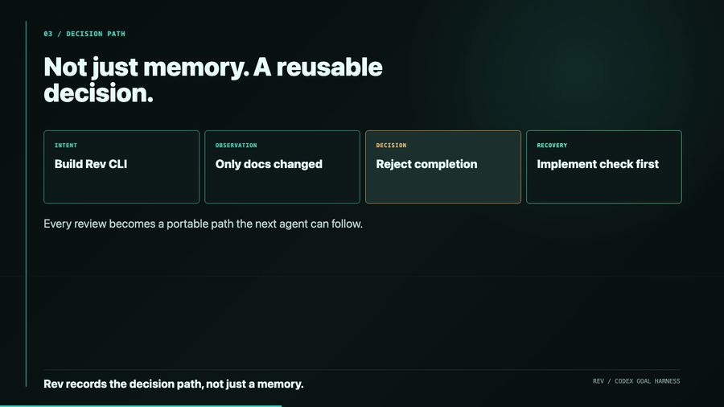

# Rev

Rev is an automatic second-opinion hook for Codex `/goal`.

**Codex says "done." Rev checks whether the goal is actually done.**

Autonomous coding agents can pass tests, write a confident final message, and
still miss what the user asked for. Rev closes that trust gap by reviewing the
original goal against the actual evidence: git diff, tests, deterministic
validators, recent run memory, and a second-opinion reviewer.

The output is not just a code review. It is a goal-satisfaction verdict:



```text
Goal satisfied: yes/no
Drift: none/low/medium/high
Decision path: Intent -> Observation -> Decision -> Recovery
Recovery prompt: the exact prompt to continue if the run drifted
```

## What It Does

Rev is a small Bun CLI plus local inspector that can run at the end of a Codex
`/goal` session and answer the question that matters:

```text
Did this autonomous run actually satisfy the user's goal?
```

The current version:
- read the goal/spec from `.rev/goal.md`
- capture git status, staged diff, unstaged diff, combined diff, and untracked
  text files
- run the configured test command
- run deterministic validators before the reviewer
- run a reviewer command against the goal, evidence, test output, validators,
  and recent Rev memory
- write `.rev/report.md`
- write `.rev/recovery-prompt.md` when the reviewer says the goal is not done
- append compact run memory to `.rev/memory.jsonl`
- append portable decision paths to `.rev/decisions.jsonl`
- serve a local dashboard at `http://127.0.0.1:37887`
- search prior decision paths with `rev search`

Do not build the full Portel/Tel product here. This repo is only the Rev
hackathon harness.

## Project Memory

The `wiki/` folder is the Rev knowledge base. Codex should read it before
making design changes and update it when a run learns something useful.

## Demo Story

During the Ralph Loop, Codex can work autonomously for an hour. Rev gives the
human a second opinion before accepting the result.

```text
/goal Build feature X
Codex edits code
Rev runs automatically at the end
Rev reviews goal + diff + tests
Human comes back to a verdict, dashboard, and recovery prompt
```

## Commands

```bash
./bin/rev init
./bin/rev check
./bin/rev report
./bin/rev serve
./bin/rev search <query>
```

For a live judging demo, run:

```bash
bun run demo
```

That script runs tests, runs `rev check`, prints the verdict, searches the
approval decision path, and opens the local inspector.

`rev check` is the main gate. It writes the review packet into `.rev/`.
`rev serve` opens the file-backed inspector. If the default port is busy, Rev
uses the next available port and prints the URL.

## Quickstart

Use Bun. From a fresh checkout:

```bash
bun install
bun test
./bin/rev check
./bin/rev serve
```

For a new goal, edit `.rev/goal.md` or pass an initial goal:

```bash
./bin/rev check "Build the smallest useful feature and verify it"
```

Generated Rev artifacts are ignored by git, so repeated dogfood runs do not
pollute the review diff.

## Output Files

```text
.rev/status.txt
.rev/staged.diff.patch
.rev/unstaged.diff.patch
.rev/diff.patch
.rev/untracked-files.txt
.rev/test-output.txt
.rev/validators.json
.rev/reviewer-output.txt
.rev/review.json
.rev/report.md
.rev/recovery-prompt.md
.rev/memory.jsonl
.rev/decisions.jsonl
```

The required completion check is:

```bash
./bin/rev check
```

The latest dogfood run on this repo produced `.rev/report.md` with
`Goal satisfied: yes`.

On a clean tree, `.rev/validators.json` may warn that there are no reviewable
changes outside `.rev/`. That is expected after everything is committed. The
selling-point verdict is in `.rev/report.md`: whether the goal is satisfied,
whether drift was detected, and whether a recovery prompt is needed.

## Reviewer Backends

Rev defaults to a goal-aware Codex reviewer:

```bash
codex exec -s read-only
```

Optional later backends:
- `claude`
- `gemini`
- custom command configured in `.rev/config.json`

For local tests, Rev also supports an internal deterministic reviewer by setting
`reviewCommand` to `"internal"` in `.rev/config.json`.

## Hook Shape

Codex hook support may vary by environment. For the hackathon, Rev should work
even without a native hook:

1. Codex `/goal` follows `AGENTS.md`.
2. Before final completion, Codex runs `rev check`.
3. If native Codex hooks are available, wire the stop/finish hook to `rev check`.

The product idea is the same either way: autonomous work ends with a trust
report, not just a diff.

## Inspector

The inspector is intentionally file-backed. It reads `.rev/goal.md`,
`.rev/review.json`, `.rev/validators.json`, `.rev/test-output.txt`,
`.rev/report.md`, `.rev/recovery-prompt.md`, `.rev/memory.jsonl`, and
`.rev/decisions.jsonl`.

Its main object is the decision path rail:

```text
Intent -> Observation -> Decision -> Recovery
```

The dashboard also shows Goal Match, Drift, Tests, Recovery, run history, and
copy actions for recovery prompts and decision paths.
