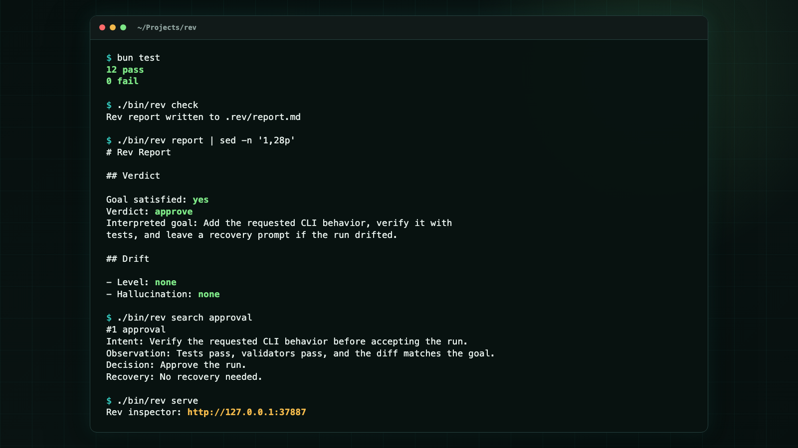
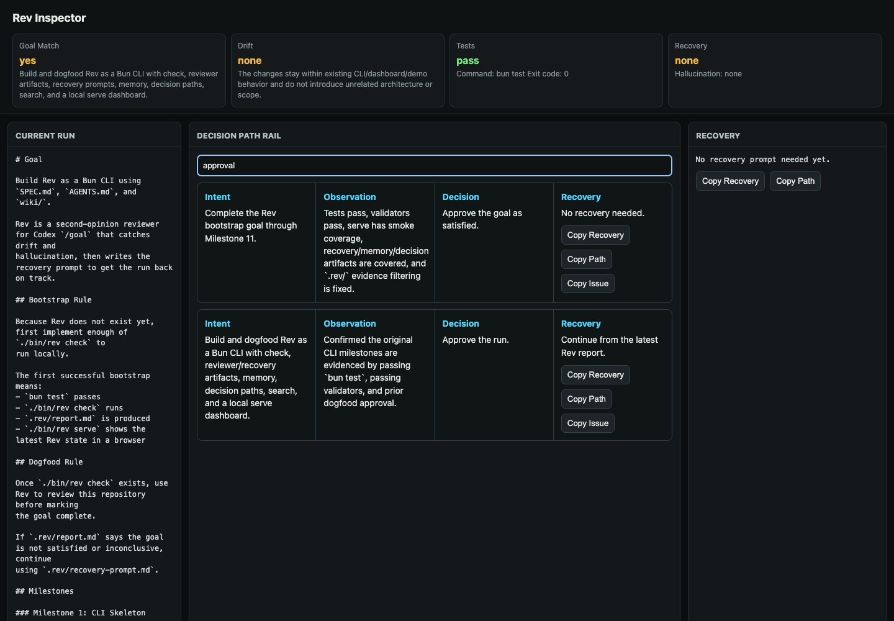

# Rev

**Codex says "done." Rev checks whether the goal is actually done.**

Rev is a second-opinion gate for autonomous Codex `/goal` runs. When Codex is
about to say "done," Rev can run automatically as a Codex Stop hook and compare
the original goal with the actual evidence in the repo: git diff, test output,
deterministic validators, recent run memory, and a reviewer verdict.

Agents can pass tests, write a confident final message, and still miss what the
user asked for. Rev is the checkpoint before you accept the run.


```text
Goal satisfied: yes/no
Drift: none/low/medium/high
Decision path: Intent -> Observation -> Decision -> Recovery
Recovery prompt: the exact prompt to continue if the run drifted
```

## Automatic Shape

Rev has two parts:

```text
Codex Stop hook -> rev check -> Rev inspector
```

When Codex is about to finish a `/goal` run, the Stop hook runs `rev check`.
If Rev approves, Codex can stop. If Rev finds drift, the hook feeds Codex the
recovery prompt and the run continues instead of ending with a false "done."

Manual `./bin/rev check` still exists for debugging and non-hook environments,
but the intended workflow is automatic.

Hook details: [docs/hooks.md](docs/hooks.md)

## Why Rev Exists

Autonomous coding changes the review question.

The old question was:

```text
Do the tests pass?
```

The new question is:

```text
Did the agent actually satisfy the user's goal?
```

Rev answers that second question. It creates a review packet, asks a
goal-aware reviewer for a verdict, stores a portable decision path, and feeds a
recovery prompt back into Codex when the run needs to continue.

## Quickstart

```bash
bun install
bun test
./bin/rev check "Build the smallest useful feature and verify it"
./bin/rev serve
```

`rev serve` prints a local inspector URL. By default it uses
`http://127.0.0.1:37887`; if that port is busy, Rev uses the next available
port.

For the prepared demo:

```bash
bun run demo
```



## How It Fits Codex `/goal`

Use Rev as the final gate for an autonomous run. This repo includes a
project-local Codex Stop hook in `.codex/hooks.json`.

```text
1. Start Codex with /goal.
2. Codex changes the repo.
3. Codex tries to stop with "done."
4. Rev runs automatically.
5. If Rev rejects the run, Codex continues with Rev's recovery prompt.
```

Codex asks you to review and trust new project hooks. In the Codex CLI, open:

```text
/hooks
```

Trust the Rev Stop hook once for the repository. After that, the automatic gate
runs whenever Codex presents a turn as complete.

Manual fallback:

```bash
./bin/rev check
```

## What `rev check` Does

`rev check`:

- reads the goal from `.rev/goal.md` or the command argument
- captures git status, staged diff, unstaged diff, combined diff, and
  untracked text-file names
- runs the configured test command
- runs deterministic validators before the reviewer
- sends goal, evidence, tests, validators, and recent memory to the reviewer
- writes `.rev/report.md`
- writes `.rev/recovery-prompt.md` when the goal is incomplete or inconclusive
- appends compact run memory to `.rev/memory.jsonl`
- appends portable decision paths to `.rev/decisions.jsonl`

## Commands

```bash
./bin/rev init
./bin/rev check ["goal"]
./bin/rev report
./bin/rev serve
./bin/rev search <query>
```

## Output Files

```text
.rev/status.txt
.rev/staged.diff.patch
.rev/unstaged.diff.patch
.rev/diff.patch
.rev/untracked-files.txt
.rev/test-output.txt
.rev/validators.json
.rev/reviewer-output.txt
.rev/review.json
.rev/report.md
.rev/recovery-prompt.md
.rev/memory.jsonl
.rev/decisions.jsonl
```

Generated Rev artifacts are ignored by git, so repeated runs do not pollute the
review diff.

## Reviewer Backends

Rev defaults to a goal-aware Codex reviewer:

```bash
codex exec -s read-only
```

You can configure a different reviewer command in `.rev/config.json`. For local
tests, Rev also supports a deterministic internal reviewer:

```json
{
  "reviewCommand": "internal"
}
```

## Inspector

`rev serve` starts a file-backed local dashboard over the latest `.rev/`
artifacts. It shows:



- original goal and reviewer interpretation
- goal match, drift, tests, and recovery status
- deterministic validator results
- latest report and recovery prompt
- run memory
- searchable decision paths

The main object is the decision path rail:

```text
Intent -> Observation -> Decision -> Recovery
```

That path is the useful artifact. It explains what the user asked for, what the
agent actually did, what Rev decided, and how to continue.

## Project Knowledge

The `wiki/` folder contains design notes, architecture decisions, and research
behind Rev. It is part of the project context for future agent runs.
